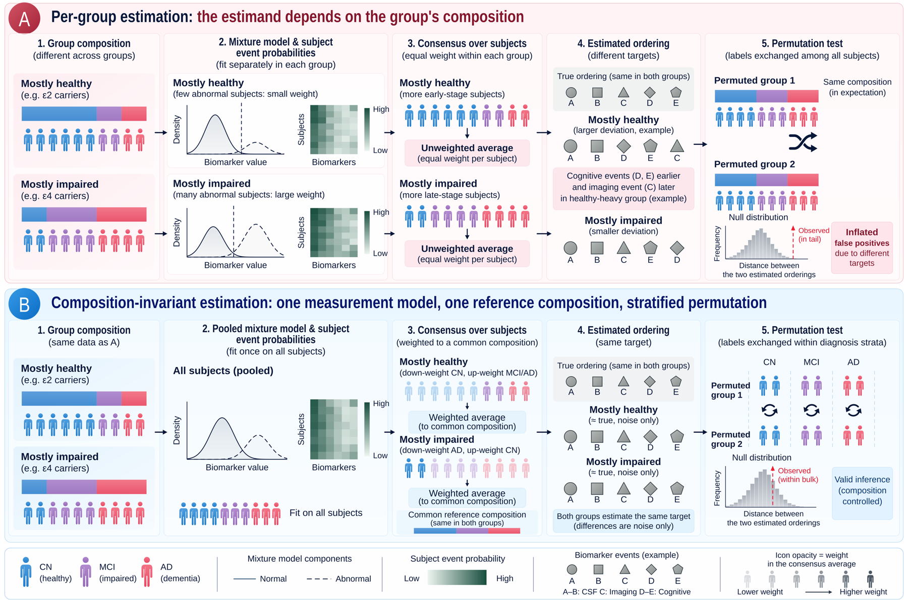

# CONCORD

Compare event-based model (EBM) orderings between groups — without the group's diagnostic
composition deciding the answer.



**(A)** Fitting an EBM separately to each group gives orderings whose *target* depends on how many
healthy, impaired and demented subjects the group happens to contain: two groups with the same
disease process end up with different orderings, and a permutation test that shuffles labels among
everyone compares them against a world in which the groups look alike.
**(B)** CONCORD fits one measurement model for all subjects, averages every group's evidence at one
reference composition, and shuffles labels only within diagnosis strata — so both groups estimate the
same target and the reference distribution keeps each group's composition.

## Install

```bash
pip install git+https://github.com/aarontgao2023/concord-ebm
```

Python ≥ 3.10. Pulls in the unmodified `pyebm==2.0.3`, which CONCORD verifies before every fit.

## Use

```python
import pandas as pd, concord

df = pd.read_csv("cohort.csv")   # PTID, Diagnosis (CN/MCI/AD), a group column, biomarker columns
result = concord.compare(df, group_column="APOE", B=599, workers=8)
print(result.summary())
result.to_json("result.json")
```

or from the shell:

```bash
concord cohort.csv --group APOE --B 599 --workers 8 --output result.json
```

You get back, for every pair of groups, the estimated orderings, their distance, the permutation
*p*-values under the stratified reference (primary), the pair-restricted reference (localisation) and
the unrestricted one (for comparison), the exact decisions under a fixed permutation budget, and the
diagnostics that tell you whether the comparison was a fair one: composition table, effective sample
size, resampling stability, and the stratified-minus-unrestricted *p* difference.

## Read more

- [User manual](docs/USER_MANUAL.md) — input format, every option, the output schema, how to read the
  diagnostics, when not to use it, the simulator, performance.
- [Changelog](CHANGELOG.md)

## Cite

Manuscript in preparation; see [`CITATION.cff`](CITATION.cff).

## Licence

GPL-3.0-or-later (CONCORD patches and adapts code from the GPL-3 `pyebm`).
